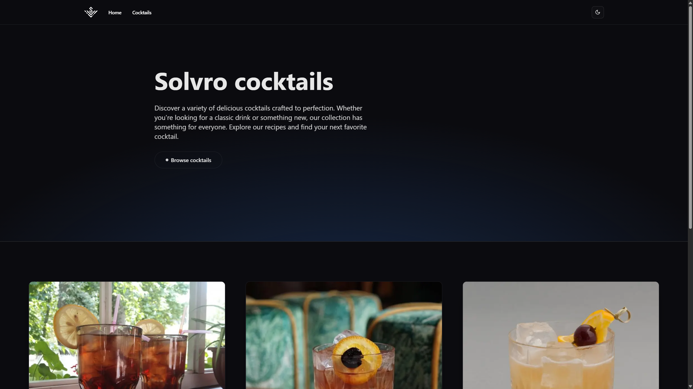
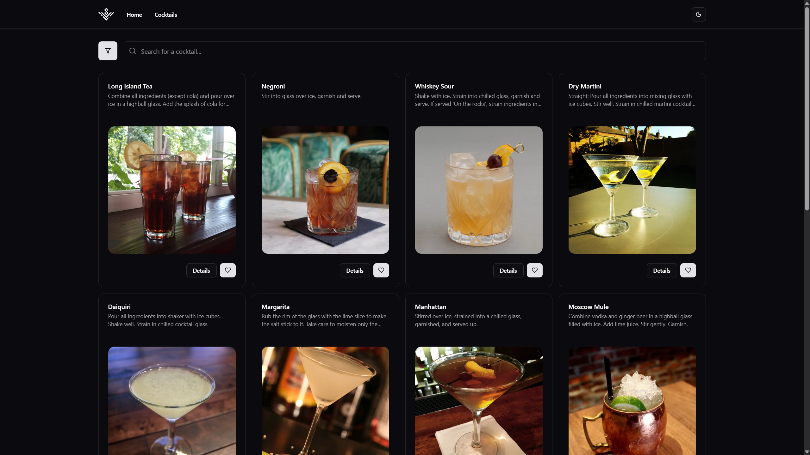
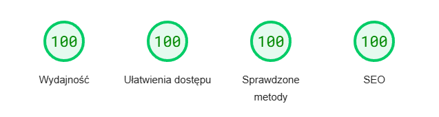
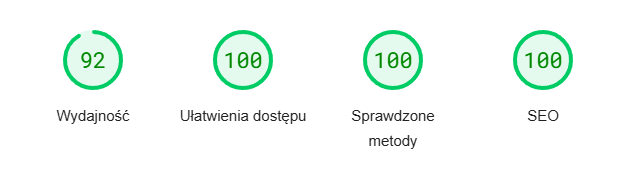

# Solvro zadanie rekrutacyjne

Strona zrobiona jako zadanie rekrutacyjne do koła naukowego "Solvro" Politechniki Wrocławskiej

> Utwórz aplikację w technologiach webowych realizującą następujące funkcjonalności:
>
> - Wyświetlanie listy koktajli
> - Zaznaczanie koktajlu jako ulubiony
> - Wyszukiwanie i filtrowanie koktajli - użyj wybranych pól, które zwraca API i uważasz je za przydatne dla użytkownika
> - Zobaczenie szczegółów koktajlu, a zwłaszcza jego składników
>
> Postaraj się, aby aplikacja była ładna i przyjazna dla użytkownika 😉 Możesz dodać dowolne funkcje, których uznasz za stosowne.
> Jako API użyj naszego Cocktails api dostępnego pod adresem [https://cocktails.solvro.pl](https://cocktails.solvro.pl)

via: [github.com/Solvro/rekrutacja/](https://github.com/Solvro/rekrutacja/blob/main/frontend.md)

## Screenshots





## Features

- **Pełna responsywność** - strona przystosowana do każdego urządzenia, zastosowanie _Mobile First Design_
- **Typescript** - niezawodny, łatwy w utrzymaniu kod
- **Duża wydajność:**

  Stacjonarny:\
  

  Komórka:\
   

  [PageSpeed Insights](https://pagespeed.web.dev/analysishttps-solvro-zadanie-rekrutacyjne-vercel-app/nnpsrsdmj2?hl=pl&form_factor=desktop)

## Użyte technologie

- **Next.js**
- **Typescript**
- **tailwindcss**
- **Shadcn**
- **Motion**

Deployment - **Vercel**

## Uruchom lokalnie

Sklonuj repozytorium:

```bash
git clone https://github.com/michalges/solvro-zadanie-rekrutacyjne.git
```

Zainstaluj potrzebne pakiety:

```bash
npm install
```

Uruchom serwer:

```bash
npm run dev
```

Następnie otwórz [http://localhost:3000](http://localhost:3000) w przeglądarce by zobaczyć stonę.
